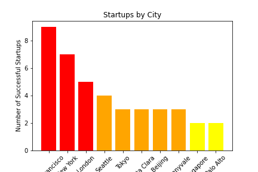

# Best City Location

In this project, the objective is to use both the MongoDB "Companies" and the API from FourSquare to find the perfect location for setting the office of a new Gaming Industry Startup. I divided my project in three steps: Choosing the candidates, testing if they are valid and finding the perfect place. 

STEP 1: CHOOSING MY FINAL CANDIDATES (USING MONGODB)

My first approach was to find the best coordinate candidates in order to set up my company in the best place possible. 

First, I filter the Companies DB in order to obtain the 3 cities with most successful startaps; for me, the most successfull startaps were the ones with at least 1 Million $ in valuation amount: for me is a way more solid than basing the company in the raising funds. So I obtained that the cities with more tech startaps were San Francisco, New York and London. 

For choosing the locations in each citiy, I still used Mongo's Companies DB to find the last deadpooled Game Startup for each city; even they failed, they pick the location wisely (I hope) and they will have the perfect spacing for all the departments involved in this kind of tech small business. 

STEP 2: TESTING THE CANDIDATES (USING FOURSQUARE):

When everyone has a different opinion, it is impossible to make everyone happy: It's a classic Kobayashi Maru situation, where no one can win. So taking this into consideration, it is important to priorize what we define as "important", and "less important".

First of all, let's take a look at the variables chosen: The Backend Developers will be happy as the first requirement was what they asked, but I based my choice in startap opportunities, not in their opinion; so let's take a look at the rest of requests. 
We can split all the variables into two differenciated groups: Let's called them the density variables and unique variables. 

The first group is corresponded to those variables that its importance is based on "how many", and the unique variables are those whose importance is "how far". The perfect example of the second group will be the Starbucks Coffe: If you have one at 5 meters, it does not matter than the next one is 10 meters away or 10 kms, your requirement will be satisfied with the first value. The density variable, on the other hand, is based on the density of the determined values that make the requirement correct, great or deficient. 
The two variables that I found that correspond to the first group were the "Near Design companies" variable and the "Diversity of bars" variable. 

Instead of comparing them to see who has more, I just will set a bar: if they fail, then the candidate will be dropped: 

THE MINIMUM: At least 10 bars in 300 meters around, and at least a couple of desing companies in 10 kms. I filtered in the Foursquare API by category, radius and near each location of the candidates to find the results: 

As per our second step, we should drop London as the location failed to arrive to the minimum requirements, both Bars and Design companies; San Francisco will be the "correct" and NY the "great", but we still have a long path to select the final candidate!

STEP 3: THE UNIQUE VARIABLES: VISUALIZATION, DISTANCE, EQUATION AND WINNER

(Even tought the idea is to drop London of the competition, I take the city into consideration in case the rest of the criteria treats it well; in case of even results, it will be the first eliminated)

We just set the bar of the "Density variables", so it is now turn of the "Unique variables" to come into action! 

First of all, I create a function to (longitud and latitude of a certain place given), set a map with all the nearest places that we want to take into account that can be found in the Foursquare API: Airport (long-distance travels), Metro/Bus Station(short-distance travels), Train/Tram Station(medium-distance travels), Elementary School, Kindergarten, Vegan Restaurant (I know that it might be considered a density variable, but for me one is enough), Basketball Stadium and Starbucks Coffee. This are the maps of the 3 locations and the icons of this unique variables: 

SAN FRANCISCO

NEW YORK

LONDON

Just looking at the maps it is complicated to compare this places, so I used the same API to create a function that returns me a dictionary of the distance of each place from the original coordinates. 

Is with this distance that I want to set an equation to find the best final location out of the candidates. First of all, let's take a look at the dictionaries: for better observation I set a dataframe of the 3 dictionaries: 

Distance	Metro/Bus	Train/Tram	Airport	School	Kindergarten	Starbucks	Vegan	Stadium
City								
San Francisco	668	1210	18435	3861	2032	579	616	1283
New York	500	1576	1652	4123	3557	1288	96	1100
London	2062	2185	22521	6651	5384	916	574	1192

| Distance |  Metro/Bus | Train/Tram | Airport | School | Kindergarten | Starbucks | Vegan | Stadium |
| --- | --- | --- | --- | --- | --- | --- | --- | --- |
| San Francisco | 668 | 1210 | 18435 | 3861 | 2032 | 579| 616 | 1283 |
| New York| 500 | 1576 | 1652 | 4123 | 3557 | 1288 | 96 | 1283 |
| London | 2062 | 2185 | 22521 | 6651 | 5384 | 916 | 574 | 1192 |

Now we have a lot of comparisons and a lot of different distance, so... how can we compare the city locations as a whole? After thinking about it, three ways of comparing the different distances came to my head; comparing the importance of the distance depending on:  
1. The people affected
2. The heriarchy, being "1" the CEO, "2" the executives and "3" the rest of the members. 
3. Personal opinion: The ranked importance of each unique variable. For me, the order of high to low importance is: Metro/Bus, Train/Tram, Kindergarten, Airport, School, Starbucks, Vegan Restaurant and Basketball stadium. 

Finally, I decided to play safe and use a combination of the 3 conditions. 

It appears that NY is clearly the winner, but one problem was still there: if we are considering the total distance of each place in our equation, maybe there is 1 single value that can "destroy" the whole data: imagine that the basketball stadium, with little importance, has a range from 1 meter to 100 kms; even bein the less important value of the whole list, it will make a hughe impact in the final equation. 

To avoid this i created a new dataframe ranking the distance from 1 to 3 (nearest to farest) to compare not the absolute values, but just its poistion compared to the others. 

Looking at the graph, we can conclude that NY, according to Step 2 and Step 3, is the winner. We found our perfect candidate. I hope you are ready, Ubisoft!